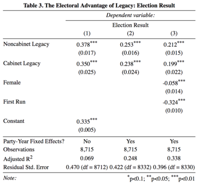
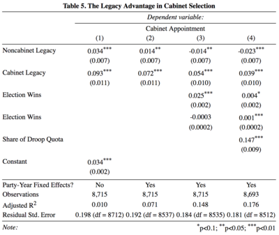
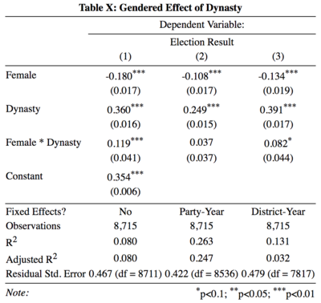
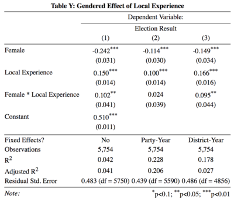

<style>
.remark-slide-number {
  position: inherit;
}

.remark-slide-number .progress-bar-container {
  position: absolute;
  bottom: 0;
  height: 4px;
  display: block;
  left: 0;
  right: 0;
}

.remark-slide-number .progress-bar {
  height: 100%;
  background-color: white;
}
</style>

```{r setup, include=FALSE}
options(htmltools.dir.version = FALSE)
library(knitr)
library(tidyverse)
library(stargazer)
library(lfe)

```

---

# Outline

--

### I. Political Dynasties

--

#### What are they? Why do we care?

--

### II. Irish Politics

--

#### More than shamrocks and Guinness!

--

### III. Smith and Martin (2017)

--

#### Is there a Google Translate for Stata?

--

### IV. Extension: Role of Gender

--

#### Do certain factors have a gender-specific effect?

---
class: middle, center
# I. Political Dynasties

---
layout: true

# I. Political Dynasties

---

## Power begets power

#### Dal Bó et al (2007) find a causal relationship between tenure in office and having a dynastic successor. This political power is self-perpetuating since a postivie exogenous shock to an individual's political power can be transmitted across generations.

## May have some negative effects...

## But also grant legitimacy to the government

---

## Power begets power

## May have some negative effects...

#### Eapen George and Ponattu (2017) estiamte that dynastic rule tends to slow economic growth within each dynastic constituency, worsen the provision of public goods across constitutencies, and heighten ethnic polarization among voters.

## But also grant legitimacy to the government

---

## Power begets power

## May have some negative effects...

## But also grant legitimacy to the government

#### Smith and Martin (2017) explore the idea that parliamentary leaders may give cabinet positions to political dynasties because of familiarity with how the system works and public goodwill.

---
layout: false
class: middle, center

# II. Irish Politics
---
layout: true
# II. Irish Politics

---

## PR-STV (not a disease)

#### Proportional Representation

* Leads to many parties (but a few big ones)

* Coalition-style governments lasting no more than 7 years

#### Single Transferable Vote

* Multiple candidates per party per district

* Makes this an ideal case --> very candidate-focused elections

## Parties and Power

---

## PR-STV

## Parties and Power

#### US House of Representatives --> Irish Dail

* Congressman --> Teachta Dala (TD)

* US Senate --> Irish Seanad

#### Major parties not that ideological

* Fine Gael and Fianna Fail

* Labour and Sinn Fein are viable other options

* Other movements based in ideology

---
layout: false
class: middle, center
# III. Smith and Martin (2017)

---
layout: true
# III. Smith and Martin (2017)

---

## Focuses

* Analyzing the *electoral* advantage of legacies over nonlegacies

* Determining the *positional* advantage of cabinet legacies over noncabinet legacies

* Explaining this advantage (if it really exists)

## Methods

## Conclusions

---

## Focuses

## Methods

#### Dataset

* Written entirely in Stata

* All Irish candidates for election to Dail from 1918-2016

* Restricted to 1944-2016 to give legacies time to come about (and to account for revolutions/civil wars)

* Lots of candidate-level data (family, education, demographics, etc.)

## Conclusions

---

## Focuses

## Methods

## Conclusions

---
layout:false
class: center, middle

```{r, echo=FALSE, warning=FALSE}
include_graphics("Presentation-figure/smf1.pdf")
```

---
class: middle, center
```{r, echo=FALSE, warning=FALSE}

```

---
class: middle, center
```{r, echo=FALSE, warning=FALSE}

```

---

# III. Smith and Martin (2017)

## Focuses

## Methods

## Conclusions

#### Legacy electoral advantage exists

#### Cabinet legacy advantage also exists

* Many explanations for mechanisms

---

class: center, middle

# IV. Extension: Role of Gender

---
layout: true

# IV. Extension: Role of Gender

---

## Part One.

#### The Gendered Effect of Dynasties

## Part Two.

---
class: center, middle

```{r, echo=FALSE, warning=FALSE}

```

---

## Part One.

## Part Two.

#### The Gendered Effect of Local Experience

---

class: center, middle

```{r, echo=FALSE, warning=FALSE}

```

---
layout: false
class: center, middle

# Questions?